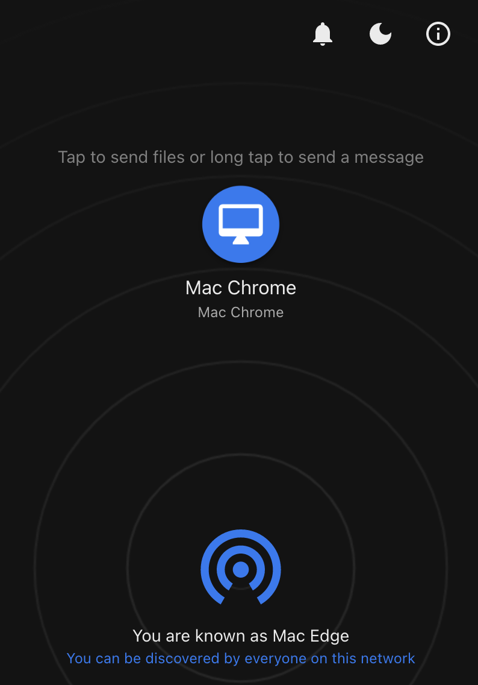
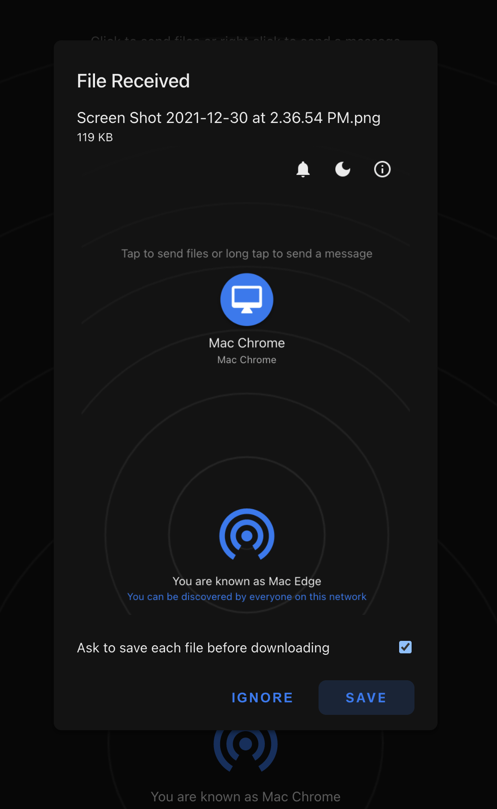

# Chromedrop 

[Chromedrop]: local file sharing in your browser. Inspired by [Snapdrop](https://github.com/RobinLinus/snapdrop)

#### Chromedrop is built with the following awesome technologies:
* Vanilla HTML5 / ES6 / CSS3 frontend
* [WebRTC](http://webrtc.org/) / [WebSockets](http://www.websocket.org/)
* [Chrome Apps](https://developer.chrome.com/docs/apps/) backend
* [Progressive Web App](https://de.wikipedia.org/wiki/Progressive_Web_App)

###

